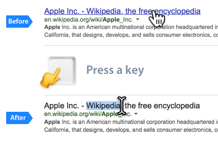

# Link Text Selector
A Safari Extension to let you select text from a link easier.

Did you ever get thwarted while trying to select some text from a link?
With this Safari Extension, you hover your mouse cursor on a link then press a hot key, the link will turn into a selectable field. This will let you be able to do that, copy a text, lookup a word, speech a paragraph or whatever you want.

#### Download:

Or [.safariextz](https://github.com/RayPS/Link-Text-Selector/blob/master/LinkTextSelector.safariextz?raw=true) (Legacy support for older macOS)

#### Teaser:

#### See in action:

#### Settings:

#### Tip:
- Double click to select a word
- Tripple click to select a paragraph

#### Donate:
I don't drink coffee that much, but if you like to support you can [send me money](https://www.paypal.me/rayps), i'll be appreciated.
